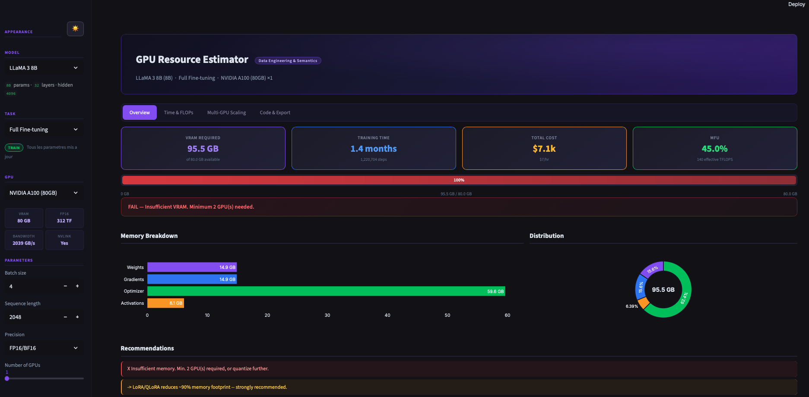

<div align="center">

# GPU Resource Estimator

**Estimate VRAM, training time, FLOPs and cloud costs for any AI model.**

[](https://python.org)
[](https://streamlit.io)
[](LICENSE)

30 GPUs &bull; 47 Model Presets &bull; 17 Task Types &bull; Dark / Light Theme



</div>

---

## Overview

GPU Resource Estimator helps ML engineers and researchers answer critical questions before launching training or inference jobs:

- **Will my model fit?** &mdash; Precise VRAM breakdown (weights, gradients, optimizer states, activations, KV cache)
- **How long will it take?** &mdash; Training time estimation based on Kaplan/Chinchilla scaling laws
- **How much will it cost?** &mdash; Cloud cost projections across 30 GPU configurations
- **How does it scale?** &mdash; Multi-GPU projections from 1 to 64 GPUs with NVLink/PCIe efficiency modeling

Available as a **Streamlit web dashboard** or a **Python CLI**.

---

## Quick Start

### Web UI (recommended)

```bash
pip install streamlit plotly
streamlit run app.py
```

### CLI

```bash
# Interactive mode
python3 gpu_estimator.py

# One-liner
python3 gpu_estimator.py --model "LLaMA 3 8B" --task "Full Fine-tuning" --gpu "NVIDIA A100 (80GB)"
```

---

## Features

| Feature | Description |
|---------|-------------|
| **VRAM Estimation** | Memory breakdown: weights, gradients, optimizer states, activations, KV cache |
| **Training Time** | Kaplan/Chinchilla scaling laws with realistic MFU per framework |
| **Multi-GPU Scaling** | 1&ndash;64 GPU projection tables with NVLink/PCIe efficiency modeling |
| **GPU Comparison** | Side-by-side cost/time across all 30 GPUs, sorted by total cost |
| **DeepSpeed ZeRO** | Memory savings for Stages 1&ndash;3, Offload, and Infinity |
| **Code Generation** | Ready-to-run PyTorch or TensorFlow profiling scripts |
| **JSON Export** | Full results export for automation and CI/CD pipelines |
| **Dark / Light Theme** | Toggle between dark and light mode with full widget theming |

---

## Web Dashboard

```bash
streamlit run app.py
```

Opens at `http://localhost:8501` with four tabs:

| Tab | Content |
|-----|---------|
| **Overview** | Key metrics (VRAM, time, cost, MFU), VRAM gauge, memory breakdown chart, recommendations |
| **Time & FLOPs** | 6 training metrics, scaling formulas rendered in LaTeX |
| **Multi-GPU Scaling** | 1&ndash;64 GPU projection table, dual-axis chart (time vs cost), GPU comparison |
| **Code & Export** | Generated PyTorch/TensorFlow profiling code, JSON download |

The sidebar provides full configuration: model preset, task type, GPU, batch/sequence/precision, DeepSpeed stage, gradient checkpointing, framework, and theme toggle.

---

## CLI Usage

### Examples

```bash
# Full fine-tuning estimate
python3 gpu_estimator.py --model "LLaMA 3 8B" --task "Full Fine-tuning" \
    --gpu "NVIDIA A100 (80GB)"

# Multi-GPU LoRA
python3 gpu_estimator.py --model "LLaMA 3 70B" --task "LoRA / QLoRA" \
    --gpu "NVIDIA RTX 4090 (24GB)" --num-gpus 4

# Pretraining with DeepSpeed + JSON export
python3 gpu_estimator.py --params 13 --task "Pretraining" --gpu "NVIDIA H100 (80GB)" \
    --num-gpus 8 --deepspeed "ZeRO Stage 3" --export results.json

# Generate profiling code
python3 gpu_estimator.py --model "Mistral 7B" --task "Full Fine-tuning" \
    --gpu "NVIDIA A100 (80GB)" --generate-code pytorch

# Quantized inference
python3 gpu_estimator.py --model "LLaMA 3.1 405B" --task "Inference (INT4/GPTQ)" \
    --gpu "NVIDIA H200 (141GB)" --num-gpus 4 --batch-size 1
```

### List available resources

```bash
python3 gpu_estimator.py --list-gpus       # 30 supported GPUs
python3 gpu_estimator.py --list-models      # 47 model presets
python3 gpu_estimator.py --list-tasks       # 17 task types
```

### All arguments

| Argument | Default | Description |
|----------|---------|-------------|
| `--model` | &mdash; | Model preset name |
| `--params` | &mdash; | Custom model size (billions) |
| `--layers` | auto | Number of layers |
| `--hidden` | auto | Hidden dimension size |
| `--task` | Full Fine-tuning | Task type |
| `--gpu` | NVIDIA A100 (80GB) | GPU model |
| `--num-gpus` | 1 | Number of GPUs |
| `--batch-size` | 4 | Batch size |
| `--seq-length` | 2048 | Sequence length |
| `--precision` | FP16/BF16 | FP32, FP16/BF16, INT8, INT4 |
| `--grad-checkpoint` | off | Enable gradient checkpointing |
| `--deepspeed` | None | DeepSpeed ZeRO stage |
| `--dataset-tokens` | 10 | Dataset size (billion tokens) |
| `--epochs` | 1 | Number of epochs |
| `--framework` | PyTorch + DeepSpeed | Training framework |
| `--export` | &mdash; | Export results to JSON |
| `--generate-code` | &mdash; | Generate `pytorch` or `tensorflow` code |
| `--no-scaling` | &mdash; | Skip multi-GPU scaling table |
| `--no-comparison` | &mdash; | Skip GPU comparison table |

---

## Supported GPUs

30 GPUs across NVIDIA (Turing &rarr; Blackwell), AMD, Google TPU, and Intel Gaudi.

<details>
<summary><strong>Full GPU table</strong></summary>

| GPU | VRAM | FP16 TFLOPS | BW GB/s | $/hr | NVLink | Arch |
|-----|------|-------------|---------|------|--------|------|
| RTX 3070 | 8 GB | 81 | 448 | $0.25 | &mdash; | Ampere |
| RTX 3080 | 10 GB | 119 | 760 | $0.35 | &mdash; | Ampere |
| T4 | 16 GB | 65 | 300 | $0.40 | &mdash; | Turing |
| RTX 4070 Ti | 12 GB | 186 | 504 | $0.40 | &mdash; | Ada |
| RTX 4080 | 16 GB | 194 | 717 | $0.55 | &mdash; | Ada |
| V100 16GB | 16 GB | 125 | 900 | $1.00 | Yes | Volta |
| L4 | 24 GB | 121 | 300 | $0.60 | &mdash; | Ada |
| A10G | 24 GB | 125 | 600 | $0.70 | &mdash; | Ampere |
| A10 | 24 GB | 125 | 600 | $0.75 | &mdash; | Ampere |
| RTX 4090 | 24 GB | 330 | 1008 | $0.80 | &mdash; | Ada |
| RTX 3090 | 24 GB | 142 | 936 | $0.50 | Yes | Ampere |
| A30 | 24 GB | 165 | 933 | $1.10 | Yes | Ampere |
| V100 32GB | 32 GB | 125 | 900 | $1.30 | Yes | Volta |
| A100 40GB | 40 GB | 312 | 1555 | $2.20 | Yes | Ampere |
| A40 | 48 GB | 150 | 696 | $1.50 | Yes | Ampere |
| RTX A6000 | 48 GB | 155 | 768 | $1.40 | Yes | Ampere |
| L40 | 48 GB | 181 | 864 | $1.60 | &mdash; | Ada |
| L40S | 48 GB | 362 | 864 | $1.80 | &mdash; | Ada |
| A100 80GB | 80 GB | 312 | 2039 | $3.50 | Yes | Ampere |
| H100 | 80 GB | 990 | 3350 | $5.50 | Yes | Hopper |
| H100 NVL | 94 GB | 1979 | 3958 | $6.00 | Yes | Hopper |
| H200 | 141 GB | 990 | 4800 | $7.00 | Yes | Hopper |
| B100 | 192 GB | 3500 | 8000 | $9.00 | Yes | Blackwell |
| B200 | 192 GB | 4500 | 8000 | $12.00 | Yes | Blackwell |
| GB200 | 384 GB | 9000 | 16000 | $18.00 | Yes | Blackwell |
| AMD MI210 | 64 GB | 181 | 1639 | $2.00 | &mdash; | CDNA2 |
| AMD MI250X | 128 GB | 383 | 3277 | $3.50 | &mdash; | CDNA2 |
| AMD MI300X | 192 GB | 1307 | 5300 | $6.50 | &mdash; | CDNA3 |
| TPU v5e | 16 GB | 197 | 819 | $1.20 | &mdash; | TPU |
| Gaudi 2 | 96 GB | 420 | 2460 | $3.00 | &mdash; | Gaudi |

</details>

---

## Supported Models

47 presets across major model families.

<details>
<summary><strong>Full model table</strong></summary>

| Family | Models |
|--------|--------|
| **LLaMA** | 3.2 1B, 3.2 3B, 3 8B, 3 70B, 3.3 70B, 3.1 405B |
| **Mistral** | 7B, Small 24B, Large 123B |
| **Mixtral** | 8x7B, 8x22B |
| **Qwen** | 2.5 0.5B, 3B, 7B, 14B, 32B, 72B |
| **Gemma** | 2 2B, 2 9B, 2 27B |
| **Phi** | 3 Mini (3.8B), 3 Small (7B), 3 Medium (14B), 4 (14B) |
| **DeepSeek** | V3 671B, R1 671B |
| **Command-R** | 35B, 104B |
| **Falcon** | 7B, 40B, 180B |
| **BERT** | Base (110M), Large (340M) |
| **T5** | Small (60M), Base (220M), Large (770M), XL (3B), XXL (11B) |
| **Vision** | ViT-Large (307M), CLIP ViT-L/14, Stable Diffusion XL, SD3 (8B) |
| **Other** | GPT-J 6B, OPT 66B, BLOOM 176B, Whisper Large v3, Gemini Nano |

</details>

---

## Task Types

<details>
<summary><strong>11 Training Tasks</strong></summary>

| Task | Mem | FLOPs | Description |
|------|-----|-------|-------------|
| Full Fine-tuning | 18x | 6x | All parameters updated |
| LoRA / QLoRA | 1.5x | 6x | Low-rank adaptation, ~1-5% params |
| Pretraining | 22x | 6x | Training from scratch |
| Continued Pretraining | 18x | 6x | Domain-specific continued pretraining |
| RLHF / DPO | 24x | 12x | Reward model + policy training |
| Distillation | 14x | 8x | Knowledge transfer from teacher model |
| Embedding / Retrieval | 4x | 3x | Sentence-BERT, E5 embedding training |
| Classification Fine-tuning | 10x | 5x | Text classification fine-tuning |
| Seq2Seq Fine-tuning | 16x | 6x | Encoder-decoder (T5, BART) |
| Vision Fine-tuning | 16x | 6x | ViT, CLIP vision model fine-tuning |
| Multimodal (VLM) | 20x | 8x | Vision-language model training |

</details>

<details>
<summary><strong>6 Inference Tasks</strong></summary>

| Task | Mem | Description |
|------|-----|-------------|
| Inference (FP16) | 2x | Model loaded in FP16 |
| Inference (FP32) | 4x | Full precision inference |
| Inference (INT8) | 1.2x | 8-bit quantized |
| Inference (INT4/GPTQ) | 0.7x | 4-bit GPTQ quantized |
| Inference (AWQ) | 0.6x | 4-bit AWQ quantized |
| Inference Batch (FP16) | 3x | High-throughput large batch |

</details>

---

## Calculation Methodology

### Memory Estimation

**Training:**

```
Total VRAM = Weights + Gradients + Optimizer States + Activations
```

| Component | Formula |
|-----------|---------|
| Weights | `params * bytes_per_param` (FP32=4B, FP16=2B, INT8=1B, INT4=0.5B) |
| Gradients | Same as weights (or ~3% for LoRA) |
| Optimizer (Adam) | 4x weights (momentum + variance in FP32) |
| Activations | `batch * seq * params * 2 / 1024^3 * 5e-5` (30% with grad checkpointing) |

**Inference:**

```
Total VRAM = Weights * multiplier + KV Cache
KV Cache   = 2 * N * 2 * S * B / 1024^3 * 0.001
```

### FLOPs (Kaplan/Chinchilla)

```
C = flops_multiplier * N * D
```

Based on [Kaplan et al.](https://arxiv.org/abs/2001.08361) and [Hoffmann et al.](https://arxiv.org/abs/2203.15556). Standard training uses `6*N*D` (2x forward, 4x backward).

### MFU (Model FLOPs Utilization)

| Framework | Base MFU |
|-----------|----------|
| Megatron-LM | 52% |
| JAX + pjit | 48% |
| PyTorch + DeepSpeed | 45% |
| PyTorch + FSDP | 42% |
| TensorFlow + XLA | 38% |
| PyTorch (vanilla) | 35% |

Architecture bonuses: Hopper +10%, Blackwell +15%, CDNA3 +5%.

### Multi-GPU Scaling

```
NVLink:  efficiency = 0.95 ^ log2(num_gpus)    # ~5% loss per doubling
PCIe:    efficiency = 0.88 ^ log2(num_gpus)     # ~12% loss per doubling
```

### Training Time

```
Time = C / (num_gpus * peak_tflops * MFU * scaling_efficiency * ds_overhead)
```

---

## DeepSpeed ZeRO

| Stage | Partitions | Mem Divisor | Overhead | Description |
|-------|-----------|-------------|----------|-------------|
| None | &mdash; | 1x | 1.00 | No parallelism |
| Stage 1 | Optimizer states | 4x | 0.95 | Optimizer state partitioning |
| Stage 2 | + Gradients | 8x | 0.90 | + Gradient partitioning |
| Stage 3 | + Parameters | 16x | 0.85 | + Parameter partitioning |
| Offload | CPU offload | 32x | 0.80 | Offload to CPU (slower) |
| Infinity | NVMe offload | 64x | 0.75 | Offload to NVMe (slowest) |

---

## Examples

```bash
# Full fine-tuning LLaMA 3 8B on A100 -> FAIL (needs 2 GPUs)
$ python3 gpu_estimator.py --model "LLaMA 3 8B" --task "Full Fine-tuning" \
    --gpu "NVIDIA A100 (80GB)" --no-scaling --no-comparison

  VRAM Required:  95.5 GB
  VRAM Available: 80.0 GB
  Status:         FAIL - Insufficient, min. 2 GPU(s) needed
```

```bash
# Same model with LoRA -> PASS (16.9 GB)
$ python3 gpu_estimator.py --model "LLaMA 3 8B" --task "LoRA / QLoRA" \
    --gpu "NVIDIA A100 (80GB)" --no-scaling --no-comparison

  VRAM Required:  16.9 GB
  VRAM Available: 80.0 GB
  Status:         PASS - Feasible with 1 GPU(s)
```

```bash
# BERT classification on a T4 -> PASS
$ python3 gpu_estimator.py --model "BERT Base (110M)" --task "Classification Fine-tuning" \
    --gpu "NVIDIA T4 (16GB)" --no-scaling --no-comparison

  VRAM Required:  1.3 GB
  VRAM Available: 16.0 GB
  Status:         PASS - Feasible with 1 GPU(s)
```

---

## Project Structure

```
gpu-estimator/
  app.py                       Streamlit web dashboard
  gpu_estimator.py             Core engine + Python CLI
  .streamlit/config.toml       Streamlit theme (dark base)
  README.md
```

<details>
<summary><strong>Module details</strong></summary>

**gpu_estimator.py**

| Export | Role |
|--------|------|
| `GPU_DATABASE` | 30 GPU specs (VRAM, TFLOPS, bandwidth, price, NVLink, arch) |
| `TASK_TYPES` | 17 task definitions (memory/FLOPS multipliers) |
| `MODEL_PRESETS` | 47 model configs (params, layers, hidden) |
| `DEEPSPEED_STAGES` | 6 ZeRO configurations |
| `FRAMEWORKS` | 6 framework MFU values |
| `estimate_resources()` | Core VRAM + FLOPs calculation |
| `estimate_training_time()` | Time estimation with MFU and scaling |
| `generate_pytorch_code()` | PyTorch profiling script generator |
| `generate_tf_code()` | TensorFlow profiling script generator |

**app.py**

| Component | Role |
|-----------|------|
| `DARK_CSS` / `LIGHT_CSS` | Full CSS themes with widget overrides |
| `metric_card()` | Reusable HTML metric card |
| `render_table()` | Themed HTML table (CSS-controllable) |
| `get_plotly_theme()` | Plotly colors per theme |
| Tab 1: Overview | Metrics, VRAM gauge, breakdown chart, recommendations |
| Tab 2: Time & FLOPs | Training metrics + scaling formulas (LaTeX) |
| Tab 3: Multi-GPU Scaling | Projection table + dual-axis chart + GPU comparison |
| Tab 4: Code & Export | Generated code + JSON download |

</details>

---

<div align="center">

**Data Engineering & Semantics**

Made by **Bassem Ben Hamed**

</div>
